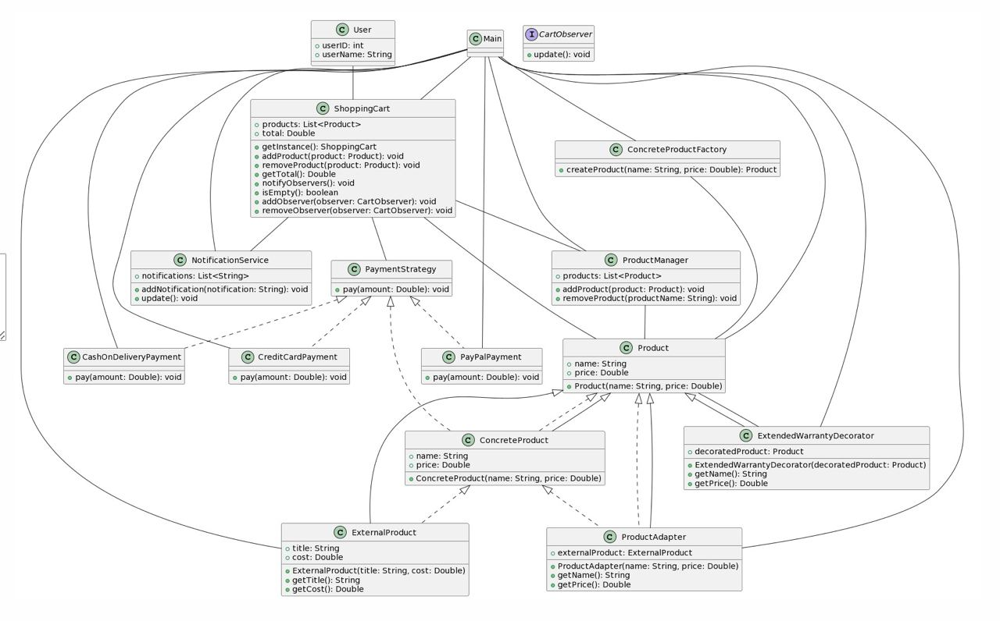

# Project Name: Shopping Cart

# Group: SE-2215

# Team members
* Tungyshbai Alisher
* Zhumagali Dastan
* Nurzhanuly Yernur

<h1 align="center">Project Overview <h1>

### Welcome to the README file for the Shopping Cart project by our dedicated team. Below, we provide an overview of the project, detailing its idea, purpose, and objectives.

### Idea of the Project
Our project, the "Online Shopping Cart," is designed to facilitate a seamless online shopping experience. Users can add products to their cart, view the cart, and proceed to checkout using various payment methods. The system also includes employee-specific functionalities for product management.

### Purpose of the Work
The purpose of our work is to create a robust and user-friendly online shopping platform. Our objectives include implementing core features like product addition, cart management, and checkout, as well as incorporating design patterns and strategies for extensibility and maintainability.

<h1 align="center">Main Body<h1>

### Features
1. Product Management (Employee Only):
   - Employees can add or remove products from the inventory.
   - Ensures secure access using an employee ID.

2. Shopping Cart Operations:
   - Users can add products to their cart.
   - View and manage the cart with options to remove products.
   - Real-time notifications for order updates.

3. Checkout with Payment Strategies:
   - Supports different payment methods: Credit Card, PayPal, and Cash on Delivery.
   - Decorates products with extended warranty options during checkout.

### Design Patterns
## 1. Singleton Pattern
The Singleton pattern ensures that a class has only one instance and provides a global point to this instance.

Example:

```java
public class ShoppingCart {
    private static final ShoppingCart instance = new ShoppingCart();

    private ShoppingCart() {
        items = new ArrayList<>();
        observers = new ArrayList<>();
    }

   public static ShoppingCart getInstance() {
        if (instance == null) {
            instance = new ShoppingCart();
        }
        return instance;
    }

    // Other methods and functionalities...
}
```
In the example, the ShoppingCart class is a Singleton, allowing only one instance to be created and providing a global point of access.

## 2. Strategy Pattern
The Strategy pattern defines a family of algorithms, encapsulates each one, and makes them interchangeable.

Example:

```java
public interface PaymentStrategy {
    void pay(double amount);
}
```

```java
public class CreditCardPayment implements PaymentStrategy {
    @Override
    public void pay(double amount) {
        // Implement payment with credit card logic.
        System.out.println("Paid $" + amount + " with Credit Card.");
    }
}

// Other payment strategy implementations: PayPalPayment, CashOnDeliveryPayment
```
In the example, the PaymentStrategy interface defines a common method, and concrete classes (e.g., CreditCardPayment) implement specific payment strategies.

## 3. Adapter Pattern
The Adapter pattern allows the interface of an existing class to be used as another interface.

Example:

```java
public interface Product {
    String getName();
    double getPrice();
}
```
```java
public class ProductAdapter implements Product {
    private ExternalProduct externalProduct;

    public ProductAdapter(ExternalProduct externalProduct) {
        this.externalProduct = externalProduct;
    }

    @Override
    public String getName() {
        return externalProduct.getTitle();
    }

    @Override
    public double getPrice() {
        return externalProduct.getCost();
    }
}
```
In the example, ProductAdapter adapts ExternalProduct to the Product interface.

## 4. Decorator Pattern
The Decorator pattern attaches additional responsibilities to an object dynamically.

Example:
```java
public abstract class ProductDecorator implements Product {
    private Product decoratedProduct;

    public ProductDecorator( Product decoratedProduct) {
        this.decoratedProduct = decoratedProduct;
    }

    @Override
    public String getName() {
        return decoratedProduct.getName();
    }

    @Override
    public double getPrice() {
        return decoratedProduct.getPrice();
    }
}

```
```java
public class ExtendedWarrantyDecorator extends ProductDecorator {
    public ExtendedWarrantyDecorator(Product decoratedProduct) {
        super(decoratedProduct);
    }

    @Override
    public String getName() {
        return super.getName() + " with Extended Warranty";
    }

    @Override
    public double getPrice() {
        return super.getPrice() + 9.99;
    }
}
```
In the example, ExtendedWarrantyDecorator enhances a product's name and price with an extended warranty.

## 5. Observer Pattern
The Observer pattern defines a one-to-many dependency between objects, where one object changes state, and its dependents are notified and updated automatically.

Example:
```java
public interface CartObserver {
    void update();
}
```
```java
public class NotificationService implements CartObserver {
    private List<String> notifications;

    public void addNotification(String notification) {
        notifications.add(notification);
    }

    @Override
    public void update() {
        // Implementation to send notifications to users
    }
}
```
In the example, NotificationService acts as an observer, receiving updates from the shopping cart.

## 6. Factory Pattern
The Factory pattern defines an interface for creating an object but allows subclasses to alter the type of objects that will be created.

Example:

```java
public interface ProductFactory {
    Product createProduct(String name, double price);
}
```
```java
public class ConcreteProductFactory implements ProductFactory {
    @Override
    public Product createProduct(String name, double price) {
        return new ConcreteProduct(name, price);
    }
}
```
In the example, ConcreteProductFactory implements the ProductFactory interface to create concrete products.

<h1 align="center">UML Diagram<h1>



### 1. Singleton Pattern: Represented by the `ShoppingCart` class, where `getInstance()` ensures that there is only one instance of the shopping cart.

### 2. Observer Pattern: Represented by the `CartObserver` interface and implemented by the `NotificationService` class. The `ShoppingCart` class acts as the subject, and the `NotificationService` is an observer that receives notifications when the cart is updated.

### 3. Factory Pattern: Represented by the `ConcreteProductFactory` interface and its implementation in the `ProductManager` class. The factory creates Product instances.

### 4. Decorator Pattern: Represented by the `ProductDecorator` abstract class and its implementation in the `ExtendedWarrantyDecorator` class. It allows adding additional behavior to the Product class.

### 5. Adapter Pattern: Represented by the `ProductAdapter` class, which adapts the `ExternalProduct` to the Product interface.

### 6. Strategy Pattern: Represented by the PaymentStrategy interface and its implementations (`CashOnDeliveryPayment`, `CreditCardPayment`, and `PayPalPayment`). The `ShoppingCart` class uses a strategy for payment.


———————


### 1. User, Product, ConcreteProduct, ProductAdapter, ExternalProduct:
   - Represent entities related to users and products.
   - ConcreteProduct and ProductAdapter implement the Product interface.

### 2. ShoppingCart:
   - Represents a shopping cart that observes changes (Observer pattern).
   - Utilizes the Singleton pattern with getInstance().
   - Composed of products, a notification service, a product manager, and a payment strategy.

### 3. ConcreteProductFactory, ProductManager:
   - Implement the Factory pattern for creating and managing products.

### 4. ExtendedWarrantyDecorator:
   - Implements the Decorator pattern by extending product functionality.

### 5. NotificationService:
   - Implements the Observer pattern, observing changes in the shopping cart.

### 6. PaymentStrategy, CashOnDeliveryPayment, CreditCardPayment, PayPalPayment:
   - Form a Strategy pattern for different payment methods.

### 7. Interfaces:
   - CartObserver is implemented by ShoppingCart for observing changes.
   - PaymentStrategy is implemented by different payment methods.
   - Product is implemented by concrete product classes.

### 8. Patterns Identified:
   - Observer Pattern: Used for tracking changes in the shopping cart.
   - Singleton Pattern: Ensures a single instance of the shopping cart.
   - Factory Pattern: Creates and manages products.
   - Decorator Pattern: Extends product functionality.
   - Adapter Pattern: Adapts external products to the product interface.
   - Strategy Pattern: Allows flexibility in payment methods.

This diagram captures the structure and interactions of your classes, highlighting key design patterns and relationships in your system.

<h1 align="center">Conclusion<h1>

### our project has effectively crafted a robust and user-friendly online shopping experience. By strategically implementing the Observer, Decorator, and Factory design patterns, we have achieved a system that not only meets the immediate requirements but also excels in terms of extensibility and maintainability.

### The Observer pattern empowers our application to seamlessly notify users about changes in their shopping cart, enhancing real-time updates and improving the overall user experience. This dynamic and responsive behavior ensures that customers are well-informed about their ongoing shopping activities.

### The Decorator pattern has been instrumental in augmenting the product offerings with extended warranties. This flexible enhancement mechanism allows us to dynamically add features to products without modifying their core structure. As a result, our customers have the option to choose products with extended warranties, contributing to a more personalized and versatile shopping environment.

### The Factory pattern has been pivotal in the creation of diverse product instances, providing a clear separation of concerns between product creation and product usage. The use of factories enhances the scalability of our application, allowing for easy integration of new products and accommodating changes in the product creation process without affecting the existing codebase.

### These design patterns collectively contribute to the overall success of our project, fostering maintainability, scalability, and adaptability. As we move forward, these foundational principles will continue to guide our development efforts, ensuring that our online shopping platform remains responsive to evolving customer needs and industry trends.

# Future Improvements
- Enhanced user interface and experience.
- Integration with external APIs for more product options.
- Further optimization of code and performance.

# Thank you for your attention!
